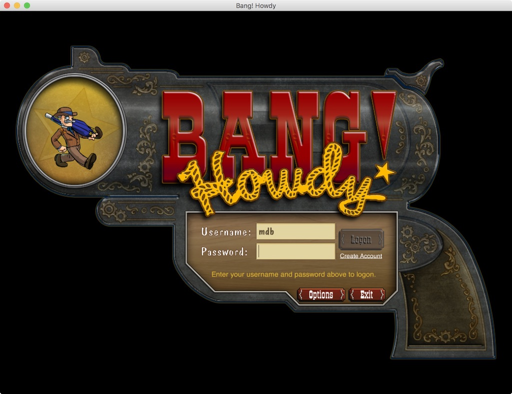

# Bang! Howdy Pardner

Herein lies the source code to the game Bang! Howdy. This is a game that was created by Three Rings
Design in 2004 and which is still limping along at http://www.banghowdy.com/

A while ago, I started a crazy project to port the game to the [libGDX] game library so that I
could run it on an iPad and in a web browser, but I never really had much time, so that project is
very very far from completion.

The current source code mostly builds, so if you're a super savvy Java programmer, you could
probably get the client and server running locally if you feel like doing some spelunknig into code
and configuration files. If you're just a tourist, you're not going to get very far, so just enjoy
looking at the code and media and please don't pester me with n00b requests about not being able to
get this or that to compile. If you can't get things to compile, there's no way you're going to be
able to do anything meaningful with the code. You ain't gonna get from your house to the top of
Mount Everest if you don't even know how to read a map.

With that nay saying nelly warning out of the way, here are some basic build instructions.

## Building and running

The game is (now) built with [Gradle], so you'll need that installed, and then you can run:

```
gradle deploy
```

which will build everything, process all the resources and prepare things to be run locally.

Assuming that worked, you'll have a `build/client` and `build/server/` directory with a bunch of
jar files in them (among a zillion other directories).

Next you need to copy all the `etc/*.dist` files into `etc/test/` without the `.dist` suffix. For
example, `etc/deployment.properties.dist` gets copied to `etc/test/deployment.properties`. In
theory you can edit those files to tweak the settings for your test deployment, but the defaults
are fine for now so just copy and rename.

You can now run the client, even though it will have no one to talk to:

```
./bin/bangclient
```

That should show you something like this:



Now you have the more complex task of setting up the server. When I said above that you don't need
to edit the files in `etc/test/*`, I lied. You have to edit `etc/test/server.properties` and
configure a username and password for a MySQL database which must be running somewhere (I recommend
on your local machine), which the Bang! server can use to store data.

There will be a section that looks like this:

```
#
# The default database mapping; all other definitions will inherit from
# this and need only be specified in cases where they differ from the
# defaults

db.default.driver = com.mysql.jdbc.Driver
db.default.url = jdbc:mysql://DBHOST:3306/bang
db.default.username = USERNAME
db.default.password = PASSWORD

# These overrides are needed for the OOO user database
db.userdb.url = jdbc:mysql://USERDBHOST:3306/ooouser
db.sitedb.url = jdbc:mysql://USERDBHOST:3306/ooouser
```

You need to change `DBHOST`, `USERNAME`, `PASSWORD` to the appropriate values for your MySQL server
(and you can set `USERDBHOST` to the same value as `DBHOST` and keep that on the same server). Then
you need to create a `bang` and `ooouser` database on your MySQL server (or change those names to
database names that you prefer and which you have created).

Then you can run the server like so:

```
./bin/bangserver
```

The first time you run it, it will create a bunch of database tables and eventually it should say
something along the lines of:

```
2016/12/17 18:32:40:993 INFO com.threerings.bang: Running in cluster mode as node 'frontier_town'.
2016/12/17 18:32:41:028 INFO com.threerings.bang: Bang server v0 initialized.
2016/12/17 18:32:41:029 INFO com.threerings.presents: DOMGR running.
2016/12/17 18:32:41:045 INFO com.threerings.narya: Server listening on 0.0.0.0/0.0.0.0:47624.
```

If so, you are tantalizingly close to logging into your own local Bang! Howdy instance. The only
final problem is that there are no users in the user database, so there's no one to log in as.

Not to worry, there's a gradle target that will create a test user in your pristine empty
database. Just run:

```
gradle server:createTestUser
```

And now you can log into your local server with username `test` and password `yeehaw`.

That's about it. You can now hack on your own private Bang! Howdy instance and implement all those
features you always wanted. Good luck!

[libGDX]: https://libgdx.badlogicgames.com/
